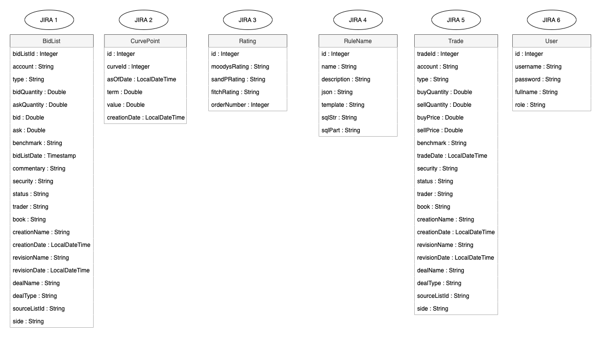

# Poseidon

Web Skeleton for Poseidon Application.

## Information
* Author : Noémie Barral
* Release date : 14 april 2021

### Running Application
* The application works on port 8080.
* The application works with a MySQL database on port 3306.
* Before running, add username and password access for database in application.properties.
* Run script schema-demo.sql before the first use to create SQL DataBase.
* Run script data-demo.sql if you want some default values for demo.
* For demo version, the SetUpDataLoader class create 1 user and 1 admin. Suppress the TODO part before production.

### Running Tests
* Test works with a MySQL database on port 3306.
* Before running, add username and password access for database in application.properties. If credentials are different for testing, complete application-test.properties to specify.
* Run script schema-test.sql before the first use to create SQL DataBase.
* Script data-test.sql is automatically managed by tests and will add default values for testing.

## Model
Following diagram shows principal steps of the project with main entity.

## Content

### Release

The first release v.1.0 contains :
* CRUD endpoints for entities in previous model
* Thymeleaf and Bootstrap front-end
* Security filters and authentication based on username and password token.
* Security role implementation. For the moment, roles have no effects on access.
